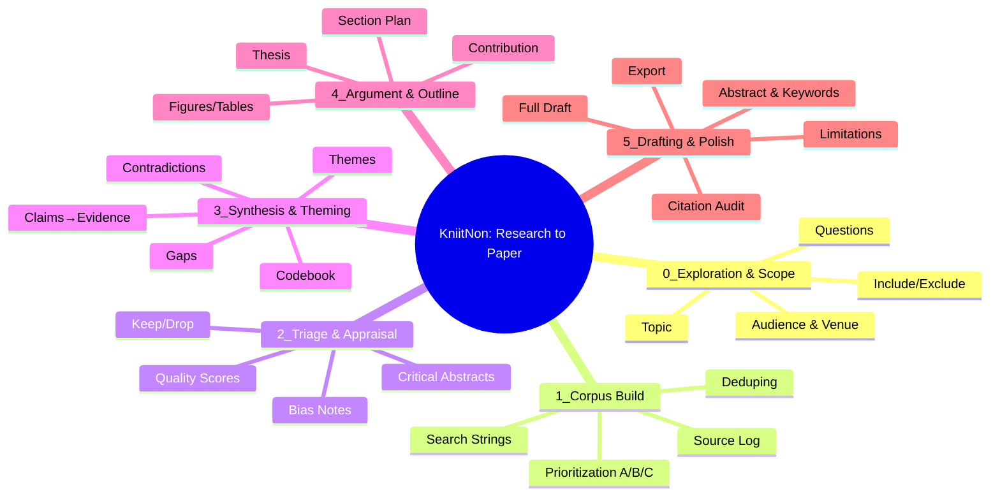

# Research Engine Stage-Gated Pipeline (v2 Rewrite)

Status: Draft pending approval (replaces prior "cartographer" plan; removes ancestor path focus).

## 0. Overview & Intent

We replace the ad-hoc topic expansion concept with a rigorously stage-gated literature-to-manuscript pipeline. Each stage yields a concrete, exportable deliverable (early value) while guaranteeing that completion of Stage 5 produces a submission-ready manuscript scaffold (outline + citations + artifacts). Users can stop after any gate with something useful.

Guiding principles:

- Stage isolation: Inputs/outputs are explicit artifacts; later stages never mutate earlier raw records (append-only notes & decisions).
- Gate discipline: Advancement only when measurable criteria met (automated + manual confirmations).
- Schema-first: Every artifact type has a JSON schema for validation & audit.
- Idempotent generation: Prompt chains can be safely re-run to refine within a stage without orphaning prior data.
- Evidence integrity: Citations tracked centrally with DOI/metadata; claim → evidence linkage mandatory from Stage 3 forward.
- Observability: Progress meter fed by gate evaluations; metrics per stage (latency, retry, coverage %).

## 1. Stage Summary

| Stage | Name | Goal | Primary Outputs | Gate (Pass Criteria) | Early Exit Deliverable |
|-------|------|------|-----------------|----------------------|------------------------|
| 0 | Exploration & Scope | Clarify topic & boundaries | topic_one_liner, refined_questions[3], venue_style, inclusion_rules, exclusion_rules | All 3 questions aligned with topic; venue style chosen; rules non-empty | 1-page scoping memo |
| 1 | Corpus Build | Assemble defensible source set | search_strings[], source_log[], deduped_library (priority tags) | >=25 A/B sources, >=5 seminal flagged | Annotated bibliography export |
| 2 | Triage & Appraisal | Decide what merits deep read | critical_abstract_notes, quality_scores, bias_notes, relevance_tags, discard_list | >=60% A sources appraised with quality rationale | Critical abstracts pack |
| 3 | Synthesis & Theming | Turn reading into structure | codebook, themed_clusters, contradiction_list, gap_statements, claims_evidence_table | Each theme: >=2 high-quality sources AND >=1 gap | Thematic synthesis brief + gap list |
| 4 | Argument & Outline | Publishable section skeleton | thesis, contribution, section_outline (claim→evidence bullets), figure_table_list | Every section has ≥1 source & takeaway sentence | Minimum viable paper outline |
| 5 | Drafting, Citations & Polish | Submission-ready manuscript | full_draft, formatted_references, citation_audit, limitations, future_work, abstract, keywords | Style guide passes; citation audit clean; all figs/tables present | Submission-ready manuscript |

## 2. Domain Model (Augmented)

Core entity groups:

- ConversationTurn: { id, role, content, ts }
- SourceRecord: { id, doi, title, authors[], venue, year, url, pdf_available, is_seminal, priority (A|B|C), addedAt }
- SearchString: { id, text, rationale, stageGenerated (0|1), enginesRun[], lastRunAt }
- AppraisalNote: { id, sourceId, abstract_summary, quality_score, bias_notes[], relevance_tags[], keep (bool), rationale, createdAt }
- CodebookEntry: { id, code, description, examples[], introducedAtSourceIds[] }
- ThemeCluster: { id, label, code_ids[], sourceIds[], contradictions[], gaps[] }
- ClaimEvidenceItem: { id, claim_text, support_sourceIds[], page_refs[], strength (low|med|high), gap_flag (bool) }
- GapStatement: { id, text, supporting_sources[], severity (minor|major) }
- SectionOutline: { id, section_id, title, order, claim_evidence_ids[], takeaway_sentence }
- Thesis: { id, text }
- ContributionStatement: { id, text, novelty_type }
- DraftSection: { id, section_id, raw_markdown, citations_extracted[] }
- Citation: { id, doi, title, authors[], venue, year, url, abstract, style_formatted, missing_doi_flag }
- CitationAudit: { id, missing_in_refs[], orphan_in_refs[], duplicate_keys[], dead_links[] }
- GateEvaluation: { id, stage, passed (bool), metrics, evaluator (auto|user), timestamp }
- ProgressSnapshot: { id, stage, percent_complete, blocking_issues[] }

All persisted under `lib/research-engine/domain/` as TypeScript interfaces + matching JSON Schemas in `schemas/`.

## 3. Artifacts & Schemas per Stage

| Stage | Key Schemas |
|-------|-------------|
| 0 | topic-scope.schema.json, research-questions.schema.json, inclusion-rules.schema.json |
| 1 | search-string.schema.json, source-record.schema.json, library-collection.schema.json |
| 2 | appraisal-note.schema.json, discard-list.schema.json |
| 3 | codebook-entry.schema.json, theme-cluster.schema.json, claim-evidence-item.schema.json, gap-statement.schema.json |
| 4 | section-outline.schema.json, thesis.schema.json, contribution.schema.json, figure-table-list.schema.json |
| 5 | draft-section.schema.json, citation.schema.json, citation-audit.schema.json, manuscript-export.schema.json |

## 4. Orchestration & Gating Engine

We replace a single "expansion orchestrator" with a StageEngine:

StageEngine responsibilities:

1. Stage Context Aggregation (only artifacts from <= current stage)  
2. PromptChain Execution (stage-defined ordered prompts)  
3. Schema Validation (AJV)  
4. Artifact Upsert (append or supersede by version)  
5. Gate Evaluation (deterministic rules + optional user override)  
6. Progress Emission (websocket/event bus)  
7. Retry & Timeboxing (per stage quotas)  
8. Early Exit Packaging (export generator)  
9. Metrics Logging (latency, coverage %, retry count)  

Each stage has a `stage-config.yaml` containing: inputs, prompts, generation order, gating rules, export definitions, metrics.

## 5. Prompt Chains Architecture

Directory: `prompt-chains/stage-{n}/` with sequential YAML files, e.g.:

```text
prompt-chains/
  stage-0/
    00_refine_topic.yaml
    01_generate_questions.yaml
    02_select_venue.yaml
    03_define_inclusion_exclusion.yaml
  stage-1/
    00_generate_search_strings.yaml
    01_run_search_summaries.yaml
    02_prioritize_sources.yaml
  ...
```

YAML fields:

```yaml
name: refine_topic
version: 1
inputs: [raw_user_topic]
system: >
  Refine the user provided topic into a precise, scholarly one-liner.
output_schema: ../schemas/topic-scope.schema.json
retry: 2
examples: [...]
```

Guidelines: minimal temperature, explicit schema echo, no prose outside JSON block, provide 1 positive + 1 edge case.

## 6. Gates & Progress Metrics

Gate rules encoded in JSON logic expressions (or custom evaluators) inside `stage-config.yaml`:

Example (Stage 1):

```yaml
gate:
  rules:
    - expr: "count(priority in ['A','B']) >= 25"
    - expr: "count(is_seminal == true) >= 5"
  auto_pass: false
  requires_user_ack: true
metrics:
  coverage: "count(priority=='A' or priority=='B')"
  seminal: "count(is_seminal==true)"
```

Progress meter queries gate rule satisfaction percentages.

## 7. Early Exit Deliverables

- Stage 0: Scoping memo (topic + 3 questions + venue + inclusion/exclusion).  
- Stage 1: Annotated bibliography (library export with priority tags).  
- Stage 2: Critical abstracts pack (appraisal notes + keep/discard).  
- Stage 3: Thematic synthesis brief (themes, codebook, gaps).  
- Stage 4: Minimum viable paper outline (sections + claims + citations).  
- Stage 5: Submission-ready manuscript bundle (draft + references + appendix exports).  

Each deliverable has an export adapter producing: Markdown + JSON + (later) DOCX.

## 8. UI Mapping (KniitNon)

- Stage Navigator: linear (0→5) with lock icons for unmet gates.
- Chat ↔ Canvas Handoff: Chat runs checklist & prompt chains; canvas renders artifacts (themes graph, claims table).
- Playbooks: Saved search strings, appraisal rubrics, codebooks, outline templates (persisted via `playbook-*` schemas).
- Progress Meter: Derived from Gate evaluations; shows blockers.
- Cluster/Theme Visualization: Graph of ThemeCluster nodes sized by source count; click reveals claims & gaps.
- Outline Builder: SectionOutline interactive editor linking ClaimEvidenceItems & Citations.

## 9. Citations Workflow & Integrity

Pipeline:

1. Source capture (Stage 1) with DOI validation & metadata enrichment (CrossRef / arXiv).  
2. Appraisal attaches quality & bias notes (Stage 2).  
3. Claims link to sourceIds + page_refs (Stage 3+).  
4. Outline enforces at least one claim per section and at least one source per claim (Stage 4).  
5. Draft assembly inserts citation keys; style formatter (CSL) generates references (Stage 5).  
6. Citation audit reconciles in-text vs reference list; flags: missing DOI, dead URL, orphan refs, duplicates.  

Export enforces CSL style selection (APA/MLA/IEEE) from Stage 0 venue decision.

## 10. Minimal Paper Outline Specification

Structure guaranteed at Stage 4 gate:

1. Title  
2. Abstract & Keywords  
3. Introduction (problem, gap, contribution)  
4. Background & Related Work (themes with citations)  
5. Method (how synthesis/theming performed)  
6. Findings / Thematic Synthesis  
7. Discussion (implications, limits, future work)  
8. Conclusion  
9. References  
10. Appendices (search strings, inclusion/exclusion rules, appraisal rubric)  

Each section has: takeaway_sentence, claim_evidence_ids[], citation coverage metrics.

## 11. Operational Guidance (Do More / Avoid)

Do More:

- Timebox stages.  
- Write while reading (append draft notes to claims early).  
- Attach a source to every claim.  
- Maintain strict discard list (explain rationale).  

Avoid:

- Expanding scope after Stage 1.  
- Mixing notes without page references.  
- Drafting prose before outline gate.  
- Adding uncited figures.  

## 12. Mermaid Mindmap



## 13. Implementation Phases (Technical)

| Phase | Tech Focus | Deliverables |
|-------|------------|--------------|
| A | Foundations | Schemas (Stage 0,1), StageEngine skeleton, feature flag `RESEARCH_PIPELINE_V2` |
| B | Stage 0 & 1 | Prompt chains, search string generation + source ingest adapters |
| C | Stage 2 | Appraisal forms, quality rubric schema, gate logic |
| D | Stage 3 | Codebook + theming clustering algorithm, claims extraction prompt chain |
| E | Stage 4 | Outline builder UI integration, claim-evidence enforcement, export adapters (outline) |
| F | Stage 5 | Draft assembler, CSL formatter integration, citation audit module |
| G | Hardening | Metrics dashboards, regression tests, legacy deprecation |

## 14. Immediate Next Actions

1. Approve this stage-gated design (replace prior plan).  
2. Create initial schema files (Stage 0 & 1).  
3. Implement StageEngine base (registration, config loader, gate evaluator, artifact store interface).  
4. Add feature flag & stub endpoints: `/api/research/pipeline/stage/{n}`.  
5. Author Stage 0 prompt chain YAML (refine topic, questions, venue, inclusion/exclusion).  
6. Basic progress meter endpoint returning GateEvaluation + ProgressSnapshot.  

---

End of draft.
\n+## 15. Adapter Architecture (Quality & Time-To-Value Focus)
\n+We modularize integrations so core pipeline progress (Stages 0–5) is never blocked by any single external data source. Interfaces (TypeScript) + minimal baseline implementations first; advanced behaviors can layer later.
\n+| Adapter | Purpose | Minimal MVP (Week 1) | Later Enhancements |
|---------|---------|----------------------|--------------------|
| CorpusSourceAdapter | Fetch sources (search) | ArXiv + CrossRef basic query | Google Scholar, Semantic Scholar, OpenAlex |
| MetadataEnricher | Fill missing DOI/venue/year | CrossRef lookup | Unpaywall open-access status, citation counts |
| PDFRetriever | Obtain PDFs for quoting | ArXiv direct PDF + simple HTTP fetch | Headless browser, paywall detection |
| TextExtractor | Extract text + page spans | PDF.js basic extraction | Table/figure caption parsing, OCR fallback |
| PersonaChain | Alternate prompt perspectives | Skeptic lens for contradiction pass | Methodologist, Historian, Practitioner lenses |
| ThemingStrategy | Cluster codes → themes | Keyword + shared code overlap | Embedding clustering, incremental merge |
| ExportFormatter | Produce deliverables | Markdown + JSON | DOCX, LaTeX, audio abstract |
| CitationFormatter | Apply style | CSL via chosen style | Auto style drift detection |
| GateEvaluator | Compute pass/fail | Deterministic JSON logic | Weighted heuristics + human override UI |
| CacheLayer | Reduce latency | In‑memory LRU | Disk + persistent KV + adaptive TTL |
\n+Principle: Each adapter has a contract + fallback returning partial but valid schema output (never throws uncaught).\n+\n+## 16. Fastest Quality Levers (High ROI, Low Build Time)
\n+Ordered implementation to raise output reliability early:
\n+1. Schema Validation (already planned) – prevents downstream corruption (Day 1).
2. Deterministic GateEvaluator – enforces progression discipline (Day 1-2).
3. Corpus Dedup (DOI + fuzzy title) – raises source precision (Day 2).
4. Citation Normalization (CrossRef enrichment) – improves later outline credibility (Day 2-3).
5. Claim Evidence Link Enforcement – ensures no orphan claims appear (Stage 3 entry).
6. Page Reference Capture (when PDF available) – future-proofs for quote auditing (Stage 3).
7. Citation Audit Module stub (detect missing vs orphan) – early feedback loop (Stage 4 start).
8. Lightweight Metrics (coverage %, theme density) – surfaces quality regressions quickly.
\n+Deferred (until core stable): advanced embeddings, multi-persona contradiction scans, semantic duplicate detection, automated novelty scoring.
\n+## 17. Extended KPIs (Quality & Risk Monitoring)
\n+| KPI | Definition | Stage(s) | Target |
|-----|------------|----------|--------|
| Engine Coverage | Distinct search engines used | 1 | ≥2 (MVP), ≥3 later |
| Venue Diversity Index | Simpson diversity over venue field | 1 | >0.6 |
| Seminal Ratio | is_seminal count / total A/B | 1 | 0.15–0.30 |
| Appraisal Coverage | Appraised A sources / total A | 2 | ≥60% (gate), goal 80% |
| Theme Support Strength | Avg sources per theme | 3 | ≥2.5 |
| Claim Citation Depth | Avg distinct sources per claim | 3–4 | ≥2.0 |
| Orphan Claim Rate | Claims without sources | 3–4 | 0% (hard) |
| Gate Rework Rate | Times gate failed after pass | All | <5% |
| Citation Audit Cleanliness | (Missing+Orphan)/Total citations | 5 | <2% |
| Export Integrity Score | Schema-valid exports / attempts | All | >99% |
| Median Stage Latency | Time start→gate pass | All | Track; reduce by 20% over 3 iterations |
\n+## 18. Risk Register (Augmented)
\n+| Risk | Impact | Likelihood | Mitigation | Owner Placeholder |
|------|--------|-----------|-----------|-------------------|
| External API Drift (CrossRef/ArXiv) | Broken ingestion | Med | Versioned adapter + contract tests | Adapters Team |
| Rate Limit Exhaustion | Latency/gaps | Med | Layered cache + exponential backoff | Infra |
| Metadata Inconsistency | Citation errors | High | Enrichment normalization pipeline | Data Quality |
| Theme Overfitting (too granular) | Fragmented outline | Med | Minimum sources per theme gate | Stage 3 Lead |
| Scope Creep Post Stage 1 | Endless corpus growth | Med | Lock topic & venue after Stage 0/1 gate | Product |
| Gate Bypass Pressure | Lower quality outputs | Med | UI indicator + manual override logging | Product |
| PDF Extraction Failures | Missing page refs | Low | Retry with alternate extractor / OCR backlog | Ingestion |
| Prompt Drift | Schema invalid returns | Med | Prompt version pin + regression suite | LLM Ops |
| Duplicate Claims | Redundant outline | Med | Hash claim_text normalized | Stage 4 Lead |
| Security: Malicious PDF | Execution exploit | Low | Sandbox extraction process | Security |
\n+## 19. Prioritization Matrix (Quality vs Time)
\n+Quadrants (Quick Wins emphasized first):
\n+| Item | Effort | Impact | Quadrant | Action |
|------|--------|--------|----------|--------|
| Schema Validation | XS | High | Quick Win | Implement Day 1 |
| GateEvaluator | S | High | Quick Win | Implement Day 1 |
| Corpus Dedup | S | High | Quick Win | Implement Day 2 |
| CrossRef Enrichment | S | Med | Quick Win | Day 2-3 |
| Claim Evidence Enforcement | M | High | Major Bet | Stage 3 start |
| Citation Audit Stub | S | High | Quick Win | Stage 4 entry |
| Page Ref Capture | M | Med | Major Bet | Stage 3 |
| Multi-Engine Adapters | M | High | Major Bet | After stable Stage 1 |
| Persona Lenses | M | Med | Fill-In | Post Stage 4 |
| Advanced Theming (embeddings) | L | High | Strategic | After baseline success |
| Audio Abstract Export | S | Low | Fill-In | Optional Stage 5 |
\n+## 20. Updated Immediate Next Actions (Supersedes Section 14)
\n+1. Implement core schemas (Stage 0 & 1).  
2. Build StageEngine base + GateEvaluator with JSON logic evaluator.  
3. Implement CorpusSourceAdapter (ArXiv + CrossRef) + basic Corpus Dedup.  
4. Add feature flag `RESEARCH_PIPELINE_V2` and stub endpoints.  
5. Author Stage 0 prompt chain YAML set + validation tests.  
6. Add metrics scaffold (capture engine_coverage, seminal_ratio).  
7. Implement CrossRef enrichment + Citation schema normalization.  
8. Outline regression test harness (schema round-trip exports).  
9. Update docs: remove obsolete previous next actions reference.  
10. Prepare risk contract tests for adapters (happy path + failure).  

---
